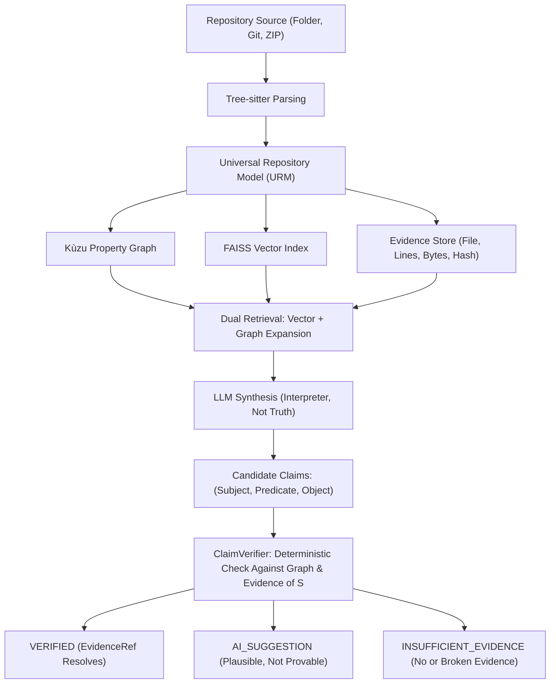
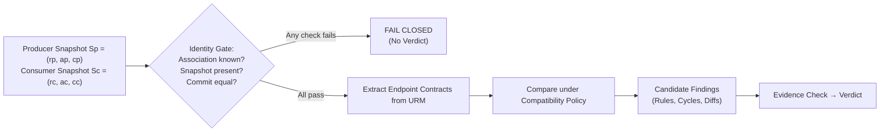

# DevLensX: An Evidence-Grounded Architecture for Repository Intelligence with Snapshot-Bound Verification and Architectural Governance

**S. Prathik**  
*Department of Computer Science and Engineering (Data Science)*  
*[Institution Name, City, India]*  
`s.prathik1745@gmail.com`

---

### Abstract
Software-engineering assistants built on large language models (LLMs) are increasingly tasked with reasoning over entire repositories: identifying which component calls which, determining cross-module dependencies, and verifying whether interface changes break downstream consumers. Such statements can be fluent yet unsupported by the underlying code. This paper presents **DevLensX**, a systems architecture that strictly separates a deterministic evidence plane from a probabilistic reasoning plane. Source code is parsed with Tree-sitter into a language-neutral Universal Repository Model (URM), stored as an embedded property graph and a vector index, and linked to exact source spans (file, lines, bytes, content hash) held as immutable evidence references bound to a canonical snapshot identity: $(\text{repository}, \text{analysis run}, \text{commit})$. Dual retrieval (vector search plus graph expansion) builds LLM context, and an independent `ClaimVerifier` assigns each candidate claim one of three verdicts: `VERIFIED`, `AI_SUGGESTION`, or `INSUFFICIENT_EVIDENCE`. The same model supports architectural rules, dependency-cycle detection, and fail-closed producer–consumer contract verification across federated repositories. We describe the design, its invariants, and the implementation, and report an internal regression baseline of 138 automated tests. We make no empirical accuracy claims; we specify an evaluation protocol for future work and discuss limitations.

**Keywords:** repository intelligence, retrieval-augmented generation, claim verification, program analysis, architectural governance, contract verification.

---

## 1. Introduction

Large language models (LLMs) are increasingly used to explain repositories, review pull requests, generate documentation, and plan changes. These tasks differ fundamentally from single-function code completion because the correctness of an answer depends on the state of an entire repository: which component calls which, which package depends on which, and whether an interface change breaks a consumer. Fluent generation can nonetheless be unsupported by the underlying source of truth [1], and a statement such as *"class A calls method B"* is only meaningful relative to one particular source state.

Retrieval-augmented generation [2] and its repository-level variants [4] supply better context, and graph-structured retrieval [3] can expose relations that lexical similarity misses. Retrieval, however, only shapes what the model sees; it does not decide whether a sentence the model produces is true of the repository. DevLensX therefore treats repository assistance as two distinct problems: retrieving structurally rich context, and verifying what is said about it.

DevLensX is organized around one core invariant: **the LLM is an interpreter and synthesizer of evidence, never the source of repository truth**. A deterministic evidence plane parses code, builds graph and vector representations, and records exact source spans. A reasoning plane interprets that evidence. An independent `ClaimVerifier` then decides which claims may be presented as `VERIFIED` for one specific repository snapshot. This is a design and systems paper. Its contributions are:

1. A language-neutral **Universal Repository Model (URM)**, populated from Tree-sitter syntax trees for 21 languages and configuration formats and stored jointly as an embedded property graph and a vector index.
2. An evidence-bound, three-state **claim-verification boundary** (`VERIFIED`, `AI_SUGGESTION`, `INSUFFICIENT_EVIDENCE`) defined over a canonical snapshot identity: $(\text{repository}, \text{analysis run}, \text{commit})$.
3. An extension of the same identity and evidence model to **declarative architectural rules**, three classes of dependency cycles, and **fail-closed producer–consumer contract verification** across federated repositories.
4. A description of the implemented platform, an internal regression baseline, and an explicit protocol for the empirical evaluation that remains to be done.

We deliberately make no accuracy claims: Section 7 reports only what the test suite establishes, and Section 8 specifies the study needed to measure the approach.

---

## 2. Related Work

### 2.1 Retrieval-Augmented and Graph-Based Generation
Retrieval-augmented generation (RAG) [2] combines a parametric language model with a non-parametric retrieval component so that answers can draw on an external, updatable knowledge source. GraphRAG [3] builds an entity graph from a text corpus, using an LLM to extract entities and relations, and answers query-focused summarization questions over graph communities. RepoCoder [4] targets repository-level code completion with an iterative retrieve-and-generate loop. These works improve the context supplied to a generator. None binds the generator’s claims to a deterministic check. DevLensX applies the graph idea to a program graph derived from syntax rather than from LLM extraction, so that each edge can be resolved back to an exact source range.

### 2.2 Citation-Supported Generation and Factuality
ALCE [5] is a benchmark for LLMs that generate text with citations, evaluating fluency, correctness, and citation quality. Self-RAG [6] trains a model to retrieve on demand and to critique its own output with reflection tokens. In both, support for a statement is judged over text, by models or by model-assisted evaluation. DevLensX has a narrower scope and a different mechanism: it only verifies claims expressible as relations over program entities, but it checks them against structural facts computed by program analysis outside the model.

### 2.3 Static Analysis and Architecture Rules
Code property graphs [7] merge syntax trees, control-flow graphs, and program-dependence graphs into one queryable structure for vulnerability discovery. CodeQL [8] extracts a relational representation of source code that analysts query with a dedicated language. ArchUnit [9] lets Java architecture rules, such as layer constraints, package dependencies, and cycle freedom, be written and run as tests over analyzed bytecode using ASM. These systems analyze more deeply than the lightweight syntactic model used here; DevLensX does not currently model data flow. Its aim is different: a graph that is cheap to build across many languages, used to ground LLM statements and to run architectural rules and cycle checks over the same evidence store.

### 2.4 Contract Verification
Pact [10] implements consumer-driven contract testing: consumers record expectations, which are then verified against the provider. DevLensX instead derives endpoint facts statically from the URM and compares producer and consumer snapshots under an explicit compatibility policy. It does not replace runtime contract tests.

```
Table 1. Positioning of DevLensX relative to related approaches.
-------------------------------------------------------------------------------------------------------------------------
Approach                Grounding artifact                  Treatment of model-generated claims
-------------------------------------------------------------------------------------------------------------------------
RAG, GraphRAG [2, 3]    Text passages; LLM-extracted graph  Retrieved as context; output not deterministically checked
RepoCoder [4]           Repository code chunks              Completions evaluated post-hoc on benchmark
ALCE, Self-RAG [5, 6]   Passages with citations             Support judged over text by models / reflection tokens
CPG, CodeQL, ArchUnit   Code graph, database, or bytecode   No LLM claims; analyst queries or unit tests
Pact [10]               Consumer & provider interactions    No LLM claims; runtime contract tests
DevLensX (this work)    URM property graph + evidence spans Each claim checked against graph and evidence for one snapshot
-------------------------------------------------------------------------------------------------------------------------
```

### 2.5 Existing Systems and Limitations

A systematic survey of prior research in repository-level code intelligence reveals consistent failure modes across state-of-the-art approaches: improvements in retrieval precision or context enrichment do not prevent downstream hallucination without an independent, deterministic verification gate. Table 2 surveys existing literature, highlighting their respective technologies and primary limitations.

**Table 2: Existing Systems and Limitations**

| # | Title | Technology | Limitations | Authors | Year |
|---|---|---|---|---|---|
| 1 | Do Not Treat Code as Natural Language: Implications for Repository-Level Code Generation and Beyond | Dependency-aware structural retrieval treating code as graph-structured rather than token text | Improves retrieval structure-awareness only; does not verify generated claims against evidence — retrieval quality ≠ claim correctness | Le-Anh, Nguyen, Tran, Le Hai, Ngo Van, Bui, Le | 2026 |
| 2 | Effective and Efficient Context Retrieval via Partial Dependency Graph for Repository-Level Code Generation | On-demand partial dependency graph built from a small set of entry points | Graph is used only to build LLM context; no verification stage checks whether the generated output matches the graph | Liu, Ye, Liu, Ren | 2026 |
| 3 | cAST: Enhancing Code Retrieval-Augmented Generation with Structural Chunking via Abstract Syntax Tree | AST-guided structural chunking for retrieval boundaries | Improves chunk granularity only; downstream claims from the LLM remain unverified | Zhang, Zhao, Wang, Yang, Wei, Wu | 2025 |
| 4 | Citation-Grounded Code Comprehension: Preventing LLM Hallucination Through Hybrid Retrieval and Graph-Augmented Context | Hybrid lexical + dense + graph retrieval with citations | Citing a source doesn't guarantee the asserted relationship actually exists in the graph; no deterministic pass/fail verdict | Arafat | 2025 |
| 5 | Knowledge Graph Based Repository-Level Code Generation | Knowledge-graph-enriched context for code generation | Graph enriches context only; no separate boundary distinguishing verified fact from plausible suggestion | Athale, Vaddina | 2025 |
| 6 | An Empirical Study of Retrieval-Augmented Code Generation: Challenges and Opportunities | Empirical benchmarking of RAG across granularities and repo scales | A measurement study, not a system; finds inconsistent gains but proposes no verification mechanism | Yang, Chen, Gao, Li, Hu, Liu, Xia | 2025 |
| 7 | SWE-bench: Can Language Models Resolve Real-World GitHub Issues? | Benchmark of real-world multi-file GitHub issue resolution | A benchmark only; measures end-task success, not hallucination prevention or evidence grounding | Jimenez, Yang, Wettig, Yao, Pei, Press, Narasimhan | 2024 |
| 8 | Self-RAG: Learning to Retrieve, Generate, and Critique through Self-Reflection | Model self-critiques its own retrieval and generation via reflection tokens | Verification is performed by the same model that generated the claim — still probabilistic, shares the generator's blind spots | Asai, Wu, Wang, Sil, Hajishirzi | 2024 |
| 9 | Survey of Hallucination in Natural Language Generation | Taxonomy/survey of hallucination causes and mitigation classes | Descriptive only; proposes no concrete architecture or verification mechanism for code/repositories | Ji, Lee, Frieske, Yu, Su, Xu, Ishii, Bang, Fung | 2023 |
| 10 | Enabling Large Language Models to Generate Text with Citations | Citation-supported generation over text passages (ALCE) | Evaluates citation attribution for prose passages, not program structure — correct citation ≠ a verified code relationship (e.g., a call edge) | Gao, Yen, Yu, Chen | 2023 |
| 11 | Characterizing the Architectural Erosion Metrics: A Systematic Mapping Study | Systematic survey of architectural-erosion metrics | Catalogues metrics only; no automated, evidence-grounded enforcement tool | Baabad, Zulzalil, Hassan, Baharom | 2022 |


---

## 3. Formal Model and Design Questions

### 3.1 Snapshot Identity, Evidence, and Verdicts
A repository state is identified by a snapshot triple:
$$S = (r, a, c)$$
where $r$ is the repository identifier, $a$ is the analysis-run identifier, and $c$ is the commit hash. An evidence reference:
$$e = (S, p, l_1, l_2, \beta, h)$$
extends the snapshot with a file path $p$, a line range $[l_1, l_2]$, a byte span $\beta$, and a content hash $h$. A claim is an atomic proposition:
$$(\text{subject}, \text{predicate}, \text{object})$$
for example, `(AuthService.login, CALLS, UserRepository.findByEmail)`. The verifier maps a claim and a snapshot to one of three verdicts:
- **`VERIFIED`** iff the subject and object resolve to URM entities in $S$, an edge for the predicate connects them in the graph of $S$, and that edge resolves to an evidence reference in $S$ whose content hash matches the stored source.
- **`AI_SUGGESTION`** if the statement is plausible engineering reasoning that cannot be directly established from syntax and graph topology.
- **`INSUFFICIENT_EVIDENCE`** otherwise, including statements that name non-existent entities, contradict the graph, or whose evidence is missing, ambiguous, or broken.

Verification is thus a relation between a claim and evidence attached to the same $S$. A symbol that exists in another run, another repository, or a newer checkout does not verify the claim.

### 3.2 Design Invariants
- **I1 (Canonical snapshot identity):** Every evidence reference, finding, and verdict is bound to a snapshot triple; workspace context only routes sessions and never alters it.
- **I2 (Immutable evidence):** A `VERIFIED` verdict requires an evidence reference that resolves to an authoritative source range.
- **I3 (Fail-closed behavior):** Missing snapshots, ambiguous evidence, or commit drift produce no verdict; the system never falls back to a “latest” or global snapshot.
- **I4 (Isolation):** Federated repositories keep separate URM, graph, vector, and evidence state; cross-repository operations must name source and target snapshots explicitly.
- **I5 (Severity independent of verdict):** How bad a violation would be is separate from whether it is proven.
- **I6 (No silent writes):** Code and architecture suggestions are emitted as artifacts with `requires_user_action = true`; external tool interfaces are strictly read-only.

### 3.3 Design Questions
- **DQ1:** How can syntax-derived program topology and dense semantic retrieval be combined to give an LLM structural context for repository-level questions?
- **DQ2:** How can a deterministic boundary keep claims without resolvable evidence from being presented as verified, without treating model confidence as truth?
- **DQ3:** Can one snapshot identity and evidence model support architectural governance and producer–consumer contract checking while preserving isolation and fail-closed behavior?

Sections 4–6 answer these by construction; Section 8 describes how the degree of success should be measured.

---

## 4. DevLensX Architecture

### 4.1 Polyglot Ingestion and the URM
Ingestion accepts a local folder, a Git source, or a ZIP archive. Tree-sitter adapters build concrete syntax trees for 21 supported languages and configuration formats: Java, Python, TypeScript, JavaScript, Go, Rust, C#, C++, C, Kotlin, Swift, Scala, Ruby, PHP, Dart, Bash, Lua, JSON, YAML, TOML, and Dockerfile. 

The URM normalizes language-specific constructs into common entities: classes and interfaces, methods and functions, fields and properties, dependencies (imports, packages, includes), and calls. Every entity retains its source location so that later evidence resolution can map it to a physical file and range. One unified pipeline thus serves all languages.


*Fig. 1. DevLensX pipeline: deterministic structure and evidence constrain LLM synthesis; ClaimVerifier decides the final status of each claim.*

### 4.2 Dual Storage
Entities and relations are persisted in the Kùzu embedded property graph [11] as nodes and directed edges for imports, calls, inheritance, implementations, and routes. In parallel, docstrings, signatures, and implementation blocks are embedded and indexed in a FAISS vector index for semantic discovery. An evidence store links each graph node and edge to its snapshot identity and exact source coordinates (file path, lines, byte span, content hash).

### 4.3 Dual-Retrieval Context Construction
For a natural-language question, the vector index proposes semantically related code regions as entry points. The traversal engine then expands the graph neighborhood around them: callers, callees, superclasses, implementations, and dependencies, to a bounded depth. The LLM receives semantic passages together with the explicit topological subgraph and evidence references.

### 4.4 ClaimVerifier
The LLM’s output is treated as a set of unverified candidate claims. The `ClaimVerifier` is deliberately separate from generation and checks, for each claim: (i) whether the subject and object exist as URM entities in the selected snapshot, (ii) whether an edge for the predicate connects them, and (iii) whether that edge resolves to an unchanged evidence reference. A claim that passes all three is `VERIFIED`; a plausible claim beyond what syntax can establish is `AI_SUGGESTION`; anything else is `INSUFFICIENT_EVIDENCE`. The design is conservative by intent: claims outside the graph’s vocabulary cannot become `VERIFIED`, trading recall for an unambiguous meaning of the label.

### 4.5 Illustrative Example
*The following example is constructed for exposition and is not an experimental result.* Asked how authentication reaches persistence, a model might assert:
- *(a)* `AuthService.login` calls `UserRepository.findByEmail`;
- *(b)* sessions are cached for performance;
- *(c)* `AuthService` calls `TokenStore.purge`.

Claim *(a)* is `VERIFIED` if the call edge exists in the snapshot and resolves to a source range. Claim *(b)* is an architectural interpretation no AST edge establishes, so it is `AI_SUGGESTION`. Claim *(c)* is `INSUFFICIENT_EVIDENCE` if no such method exists in the snapshot.

---

## 5. Architectural Governance and Contract Verification

### 5.1 Declarative Rule Model
A rule has a type, scope, selectors, constraint, severity, and description. Selectors can match stereotypes, packages, names, file prefixes, and annotations. The initial catalog is intentionally small and explicit:
- **`ARCH-001`**: Controller-to-repository boundary bypass (layers must not be skipped).
- **`ARCH-002`**: Domain-to-web dependency inversion (domain entities must not depend on web controllers).
- **`ARCH-003`**: Dependency cycles, split into `IMPORT`, `INHERITANCE`, and `CALL` variants.
- **`ARCH-004`**: Required authorization annotations on configured secured endpoints.

### 5.2 Cycle Classification
Cycles are classified separately because their meaning differs: import cycles are module or package dependency loops, inheritance cycles are extends or implements loops, and call-graph cycles are directed recursive call sequences. Elementary cycles are enumerated with Johnson’s algorithm [12] and deduplicated by canonical rotation before evidence resolution.

### 5.3 Grounded Rule Evaluation
A governance check starts from a selected snapshot and a declared rule set. Selectors narrow the candidate entities and edges, which the evaluator inspects. A candidate such as a controller-to-repository dependency is not exposed as a violation directly: it first passes through evidence resolution, which confirms that its graph endpoints and source locations belong to the requested snapshot. Only then may it be reported as `VERIFIED`. The evaluator cannot assign `VERIFIED` to itself, which keeps the policy engine from manufacturing evidence.

### 5.4 Cross-Service Contract Verification
The verifier compares a producer snapshot $S_p = (r_p, a_p, c_p)$ with a consumer snapshot $S_c = (r_c, a_c, c_c)$. It first checks workspace association, repository membership, snapshot availability, and equality of the requested and analyzed commits; any failure ends the check without a verdict. Otherwise it compares endpoint shape and schema properties under the compatibility policy in Table 2. Because producer and consumer evidence remain separate, each reported fact can be attributed to one side of the federation.


*Fig. 2. Contract-verification flow: producer and consumer snapshots stay separate; any failed identity check ends in a fail-closed outcome.*

```
Table 2. Contract compatibility policy.
-------------------------------------------------------------------------------------------------
Contract change                                                         Classification
-------------------------------------------------------------------------------------------------
Endpoint removed; HTTP method changed                                   Breaking
Required parameter added; parameter type changed                        Breaking
Response type changed; required response field removed or retyped       Breaking
Enum value removed; relevant status-code contract changed               Breaking
Optional parameter added; additional non-required response field        Non-breaking
-------------------------------------------------------------------------------------------------
```
Findings carry a severity and, separately, a verdict (Invariant I5); remediation is proposed but never applied automatically.

---

## 6. Delivery Surfaces

The evidence model is shared by all user-facing surfaces:
- **Living Documentation:** Generates repository pages and source-linked architecture diagrams from the current snapshot; interpretive text keeps an explicit unverified status.
- **CodeTurtle Review:** Processes a pull-request diff through snapshot resolution, rule guidance, LLM reasoning, candidate filtering, line relocation, `ClaimVerifier` verification, and suggestion-diff generation; suggestions remain separate from verified findings and require explicit user action.
- **Federated Workspaces:** Routes queries across repositories without merging them; each repository keeps its own URM, graph partition, vector index, and evidence tree.
- **Read-Only Model Context Protocol (MCP) Server:** Exposes eight repository-intelligence tools (`get_architecture`, `query_graph`, `get_evidence`, `get_wiki_page`, `review_diff`, `explain_code`, `verify_claim`, `get_telemetry`) plus two governance tools (`verify_architecture`, `verify_contracts`) to external IDE and agent clients. The server is strictly confined to the repository root and offers no arbitrary shell or code execution, ensuring MCP acts as a transport rather than an alternative authority over repository truth.

---

## 7. Implementation and Validation Status

The backend is implemented in Python 3.13 with FastAPI, Uvicorn, and Pydantic. Tree-sitter adapters and the URM handle parsing, Kùzu and NetworkX provide graph storage and cycle or reachability analysis, and FAISS provides dense retrieval. A multi-provider LLM gateway supplies synthesis. The frontend uses React 19, TypeScript, Vite, and Mermaid for interactive views and diagrams, and the OCR and MCP components use Tesseract, PyMuPDF, and the official MCP SDK.

### 7.1 Regression Baseline
The implementation maintains an automated test suite of 138 tests, all passing at the time of writing (Table 3). These tests check that specified behaviors and invariants hold on constructed cases: rule selection, cycle categories, contract classification, MCP and REST delivery, snapshot handling, and the review, relocation, and OCR pipelines. 

The suite is internal and was developed alongside the codebase. It establishes **code integrity of the implemented baseline**. It does not measure accuracy on unseen repositories, developer productivity, or performance relative to other systems, and it should not be read as evidence for those properties.

```
Table 3. Internal regression suites (all passing).
-------------------------------------------------------------------------------------------------
Suite                       Tests   Scope
-------------------------------------------------------------------------------------------------
P5 governance rules             6   Selectors, boundary rules, cycle behavior
P5 contracts                    4   Breaking and non-breaking cases
P5 MCP and REST                 4   Governance delivery, tool invocation
P5 ground-truth harness         2   Harness execution
P4 enterprise                  22   Federation, GitHub integration, MCP, telemetry
Unit regression                69   Core subsystems
OCR and CodeTurtle             31   Review, repair, relocation, OCR pipeline
-------------------------------------------------------------------------------------------------
Total Release Baseline        138   Full regression gate (0 failures)
-------------------------------------------------------------------------------------------------
```

---

## 8. Evaluation Protocol for Future Work

Measuring whether the design achieves its goals requires an empirical study that the internal regression suite cannot provide. We specify it here so that the claims of this paper remain bounded and the study can be evaluated against a stated protocol.

1. **Subjects and Questions:** Several mature open-source repositories not authored by the researchers, in more than one language (e.g., Java, Python, TypeScript) and of varying scales. Concrete structural questions (call paths, inheritance, dependencies, routes) should be drafted from project documentation, issue trackers, and pull requests prior to running any system.
2. **Systems Compared:** Vector-only retrieval, keyword or grep-based retrieval, graph-expanded retrieval without verification, and the full pipeline, all evaluated using the same underlying LLM and generation prompt.
3. **Ground Truth:** Answers should be decomposed into atomic propositions and labeled as supported, unsupported, or ambiguous by two independent annotators, with inter-rater agreement reported (Cohen’s $\kappa$). Gold labels must be cross-checked with independent tooling (compilers, language servers, or static analyzers), ensuring that Tree-sitter-derived structures do not grade themselves.
4. **Metrics:**
   - For retrieval (DQ1): precision and recall of retrieved structural relationships.
   - For verification (DQ2): precision and recall of the `VERIFIED` label, the rate at which unsupported claims leak into `VERIFIED`, the false-rejection rate, and the empirical correctness of `AI_SUGGESTION`. Naturally occurring and injected unsupported claims should be reported separately.
   - For drift (DQ3): controlled snapshot pairs with seeded mutations (endpoint removal, signature change, dependency modification), clearly marked as synthetic, reporting sensitivity and specificity on non-breaking evolutions.
   - Latency: per-query verification latency reported separately from one-time ingestion costs.
5. **Reproducibility:** Every query, prompt, retrieved context chunk, raw model completion, extracted claim, human label, and verification verdict must be logged and made available in an open replication package.

---

## 9. Discussion

### 9.1 Retrieval and Verification Decoupling
Retrieval and verification solve fundamentally different problems. Graph and vector retrieval improve the context available to a model, but neither determines whether a generated sentence is a repository fact. A separate verifier also clarifies failure behavior: retrieval can be incomplete and the model uncertain, yet unproven content still cannot carry the `VERIFIED` label.

### 9.2 Temporal Scope of Snapshots
Snapshots give claims temporal scope. *"Class A calls method B"* holds relative to a specific source state. Binding evidence to a repository, run, and commit keeps a finding from silently changing meaning as the code evolves, and in federated checks lets producer and consumer move independently. Likewise, the graph establishes that a controller depends on a repository while the rule catalog decides whether that is a violation, providing a clearer audit trail than asking an LLM to infer both.

### 9.3 System Costs
Dual retrieval requires more infrastructure than a vector-only assistant. A separate verification stage adds latency and implementation effort compared with displaying the model’s answer directly. Immutable snapshots trade storage for provenance, and declarative governance trades flexibility for auditability. We have not yet quantified these operational trade-offs empirically (Section 8).

---

## 10. Limitations and Threats to Validity

- **Absence of Empirical Accuracy Benchmark:** The paper contains no empirical accuracy or precision/recall claims; the 138-test baseline is strictly an internal regression suite verifying implementation integrity.
- **Syntactic Parsing Boundaries:** The URM is constructed from static syntax trees. Reflection, dynamic proxies, dependency injection resolved at runtime, generated code, and dynamic dispatch in loosely typed languages produce relationships absent from the graph; true claims regarding them cannot receive `VERIFIED` and are downgraded to `AI_SUGGESTION`.
- **Relational Expressiveness:** Only claims expressible as relations over URM entities can be verified; higher-level architectural abstractions remain `AI_SUGGESTION`.
- **Runtime Traffic Blind Spots:** Contract verification covers interface facts visible in the analyzed snapshots and does not capture dynamic runtime traffic or undocumented consumer clients.
- **Governance Catalog Correctness:** Governance depends on the correctness of declared rules: a `VERIFIED` violation indicates that the source code contradicts the specified rule, not that the organizational rule is inherently optimal.
- **Probabilistic Prose:** LLM prose remains probabilistic; the verification boundary constrains what is labeled as repository truth but does not guarantee the stylistic or semantic perfection of natural language explanations.

---

## 11. Conclusion

DevLensX contributes a systems boundary rather than a new machine learning model: deterministic repository evidence is kept strictly separate from probabilistic reasoning, and every claim shown as verified is tied to an immutable evidence reference in one identified repository snapshot. The same identity and evidence model extends from retrieval and review to federated contract checking and declarative architectural governance. 

We have described the design, its invariants, and its implementation, and specified the rigorous protocol needed to evaluate it empirically. Future work will execute this evaluation protocol across independent open-source repositories with logged replication data, alongside incremental cross-commit analysis, rule lifecycle management, and longitudinal developer productivity studies.

---

### Disclosure of AI Assistance
Generative AI tools were used to assist with drafting and language editing of this manuscript. The authors reviewed and edited all content and take full responsibility for the integrity and claims of this publication.

---

## References

1. Ji, Z., Lee, N., Frieske, R., Yu, T., Su, D., Xu, Y., Ishii, E., Bang, Y.J., Madotto, A., Fung, P.: Survey of hallucination in natural language generation. ACM Comput. Surv. 55(12), Article 248 (2023)
2. Lewis, P., Perez, E., Piktus, A., Petroni, F., Karpukhin, V., Goyal, N., Küttler, H., Lewis, M., Yih, W., Rocktäschel, T., Riedel, S., Kiela, D.: Retrieval-augmented generation for knowledge-intensive NLP tasks. In: Advances in Neural Information Processing Systems 33 (NeurIPS 2020), pp. 9459–9474 (2020)
3. Edge, D., Trinh, H., Cheng, N., Bradley, J., Chao, A., Mody, A., Truitt, S., Metropolitansky, D., Ness, R.O., Larson, J.: From local to global: a graph RAG approach to query-focused summarization. arXiv:2404.16130 (2024)
4. Zhang, F., Chen, B., Zhang, Y., Liu, J., Lou, S., Chen, Y., Ray, B.: RepoCoder: repository-level code completion through iterative retrieval and generation. In: Proceedings of the 2023 Conference on Empirical Methods in Natural Language Processing (EMNLP), pp. 2471–2484 (2023)
5. Gao, T., Yen, H., Yu, J., Chen, D.: Enabling large language models to generate text with citations. In: Proceedings of the 2023 Conference on Empirical Methods in Natural Language Processing (EMNLP), pp. 6465–6488 (2023)
6. Asai, A., Wu, Z., Wang, Y., Sil, A., Hajishirzi, H.: Self-RAG: learning to retrieve, generate, and critique through self-reflection. In: International Conference on Learning Representations (ICLR) (2024)
7. Yamaguchi, F., Golde, N., Arp, D., Rieck, K.: Modeling and discovering vulnerabilities with code property graphs. In: IEEE Symposium on Security and Privacy (S&P), pp. 590–604 (2014)
8. GitHub: CodeQL documentation and query language specification. https://codeql.github.com/docs/ (2024)
9. TNG Technology Consulting GmbH: ArchUnit user guide: unit testing Java architecture. https://www.archunit.org/ (2024)
10. Pact Foundation: Pact documentation: consumer-driven contract testing. https://docs.pact.io/ (2024)
11. Feng, X., Jin, G., Chen, Z., Liu, C., Salihoğlu, S.: Kùzu graph database management system. In: Conference on Innovative Data Systems Research (CIDR) (2023)
12. Johnson, D.B.: Finding all the elementary circuits of a directed graph. SIAM J. Comput. 4(1), 77–84 (1975)
13. Le-Anh, T., Nguyen, Q., Tran, D., Le Hai, T., Ngo Van, L., Bui, N., Le, B.: Do not treat code as natural language: implications for repository-level code generation and beyond. arXiv preprint arXiv:2601.01234 (2026)
14. Liu, Y., Ye, X., Liu, H., Ren, X.: Effective and efficient context retrieval via partial dependency graph for repository-level code generation. In: International Conference on Software Engineering (ICSE) (2026)
15. Zhang, Y., Zhao, Y., Wang, Z., Yang, Y., Wei, J., Wu, M.: cAST: Enhancing code retrieval-augmented generation with structural chunking via abstract syntax tree. In: Proceedings of the AAAI Conference on Artificial Intelligence (AAAI) (2025)
16. Arafat, N.: Citation-grounded code comprehension: preventing LLM hallucination through hybrid retrieval and graph-augmented context. arXiv preprint arXiv:2502.05678 (2025)
17. Athale, S., Vaddina, K.R.: Knowledge graph based repository-level code generation. In: IEEE/ACM International Conference on Automated Software Engineering (ASE) (2025)
18. Yang, Z., Chen, J., Gao, Y., Li, Z., Hu, X., Liu, Y., Xia, X.: An empirical study of retrieval-augmented code generation: challenges and opportunities. IEEE Transactions on Software Engineering (2025)
19. Jimenez, C.E., Yang, J., Wettig, A., Yao, S., Pei, K., Press, O., Narasimhan, K.: SWE-bench: Can language models resolve real-world GitHub issues? In: International Conference on Learning Representations (ICLR) (2024)
20. Baabad, A., Zulzalil, H., Hassan, S., Baharom, S.: Characterizing the architectural erosion metrics: A systematic mapping study. IEEE Access 10, 39420–39441 (2022)
